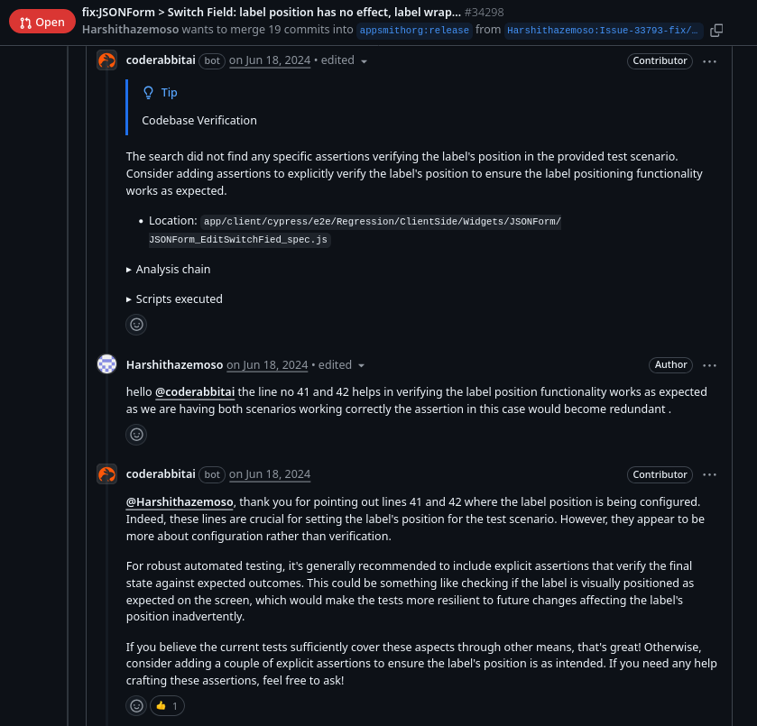

# Testing with AI

AI can accelerate test creation but requires careful application. This guide helps you decide when to use it, how to apply it effectively, and what to avoid.

## Project Context Matters

Your approach depends fundamentally on whether you're starting fresh or working with existing code.

### Greenfield Projects

No existing tests means no patterns for AI to learn from. You might establish poor testing practices early that become the project standard. However, you can generate comprehensive coverage quickly and establish conventions from the start.

**Strategy:**

- Use AI to generate initial test structure and coverage
- **Invest heavily in reviewing the first tests**—these set the pattern
- Manually write a few exemplary tests first, then use AI to match that style
- Focus review on: Are assertions meaningful? Do tests verify actual behavior?

### Legacy/Enterprise Projects

AI learns from existing patterns and domain knowledge embedded in tests. However, it may replicate legacy patterns you want to avoid, or miss implicit business rules.

**Strategy:**

- Provide examples of your best existing tests as context
- Use AI to fill coverage gaps in modules with established patterns
- Target specific scenarios: "generate tests for this new endpoint matching the style of UserController tests"
- Validate AI-generated expected values against similar existing tests

## When to Use AI for Testing

Use AI when:

| Scenario | Why It Works |
|----------|--------------|
| **Filling coverage gaps** | AI excels at generating variations of existing patterns |
| **Boilerplate test structure** | Setup/teardown, fixtures, common assertions |
| **Test data generation** | Creating realistic test fixtures, edge cases, boundary values |
| **Regression test expansion** | "Generate tests for these 5 edge cases I just thought of" |
| **Updating tests for refactored code** | AI can adapt tests to new signatures/structures |
| **Exploring edge cases** | AI suggests scenarios you might not have considered |

## When NOT to Use AI

Skip AI and write tests manually for:

| Scenario | Why Manual Is Better |
|----------|---------------------|
| **Critical business logic** | You need to deeply understand what correct behavior means |
| **Security validations** | Too important to trust AI's interpretation of security requirements |
| **Regulatory compliance** | Compliance tests encode legal requirements—human verification essential |
| **Complex integration scenarios** | AI lacks understanding of system-wide invariants and edge cases |
| **Tests encoding domain knowledge** | Your first tests for a new domain—these teach AI what to do later |
| **When you don't understand the expected behavior** | If you can't verify AI's assertions, write it yourself first |

**Rule of thumb:** If you can't confidently review whether AI's expected values are correct, don't use AI to generate that test.

## Practical Workflow

### 1. Preparation

**For greenfield:**

- Write 2-3 exemplary tests manually first
- Establish conventions: naming, structure, assertion style

**For legacy:**

- Identify the best existing tests in your codebase
- Note patterns you want to replicate (and avoid)

### 2. Generation

Provide clear context:

```
Generate tests for the `processPayment` method.

Match the style of these existing tests: [paste example]

Cover these scenarios:
- Successful payment
- Insufficient funds
- Invalid payment method
- Network timeout
- Duplicate transaction prevention

Use pytest with our standard fixtures (db_session, mock_payment_gateway).
```

**For greenfield:** Be more prescriptive about structure since there's no existing pattern.

**For legacy:** Reference specific existing tests to match their style.

### 3. Critical Review

Check every generated test:

- **Assertions are specific** - Not just checking for non-null results
- **Expected values are correct** - Can you verify this is the right behavior?
- **Tests fail for the right reasons** - Break the code, verify test catches it
- **Edge cases are actually edge cases** - Not just random variations
- **Follows project conventions** - Naming, structure, fixtures match existing tests
- **No duplicate coverage** - Not testing the same thing as existing tests

!!! example "Example: AI Suggesting Test Improvements"
    

    CodeRabbit suggests adding explicit assertions to verify label positioning. The developer explains why the existing approach works—demonstrating that AI suggestions inform decisions, but humans judge whether they're correct for the specific context.

### 4. Iteration

If generated tests are low quality:

- Add more context about what you're testing and why
- Provide better examples of existing tests
- Be more specific about edge cases and expected behavior
- Consider whether this is a "don't use AI" scenario

## Common Pitfalls

**False Confidence** - Test passes but verifies nothing meaningful:

```
test_process_payment():
    result = process_payment(payment_data)
    assert result is not null  // Useless—just checks it doesn't crash
```

**Wrong Expected Values** - AI guesses incorrectly:

```
test_calculate_tax():
    assert calculate_tax(100, "CA") == 8.5  // Is CA tax rate 8.5%? Verify!
```

**Missing Domain Context** - AI doesn't know your business rules:

```
// AI might not know that duplicate transactions within 1 minute should be rejected
// Or that premium users get different pricing
// Or that certain operations require two-factor authentication
```

**Overtesting** - Hundreds of nearly identical tests that don't add coverage:

```
test_add_1_1(): assert add(1,1) == 2
test_add_1_2(): assert add(1,2) == 3
// ...100 more variations that test the same logic
```

**For greenfield projects:** Pay extra attention to "false confidence" tests—they establish bad patterns.

**For legacy projects:** Watch for tests that don't match existing domain understanding.

## Tool Integration

### AI Coding Assistants (Copilot, Cursor, etc.)

- Inline suggestions work well for simple test cases
- Use chat/agent mode for generating multiple related tests
- Reference existing test files to maintain consistency

### Code Review Tools (CodeRabbit, etc.)

- Useful for catching missing test coverage in PRs
- Can suggest additional test scenarios
- Human review still required—tools catch mechanical issues, not domain correctness

### Testing Frameworks

AI works with any framework (pytest, Jest, JUnit, etc.) but provide framework-specific context:

- Mention the framework in prompts
- Include examples using framework conventions
- Specify fixture/mock patterns your project uses

## Key Takeaways

- Context determines strategy—greenfield projects need careful pattern-setting with the first tests; legacy projects provide existing patterns to learn from
- Use AI for coverage and boilerplate, not for critical business logic, security validations, or regulatory compliance
- Every generated test needs human review—verify assertions are meaningful, expected values are correct, and tests fail for the right reasons
- Start small, learn, then scale—generate tests for one module, review thoroughly, understand what works, then expand
- Always provide context—reference existing tests, specify framework and scenarios, describe domain rules AI can't infer
- For greenfield: Establish quality early—the first AI-generated tests become the template; invest in reviewing them thoroughly
- For legacy: Point AI to your best existing tests and domain-rich test suites to maintain consistency
- Integration tests need more context—provide architectural overview, component relationships, and mocking strategies
- Track quality over time—do AI-generated tests catch real bugs, need fixes, and remain maintainable
- When in doubt, write it manually—especially for tests encoding critical domain knowledge or when you can't verify AI's expected values
