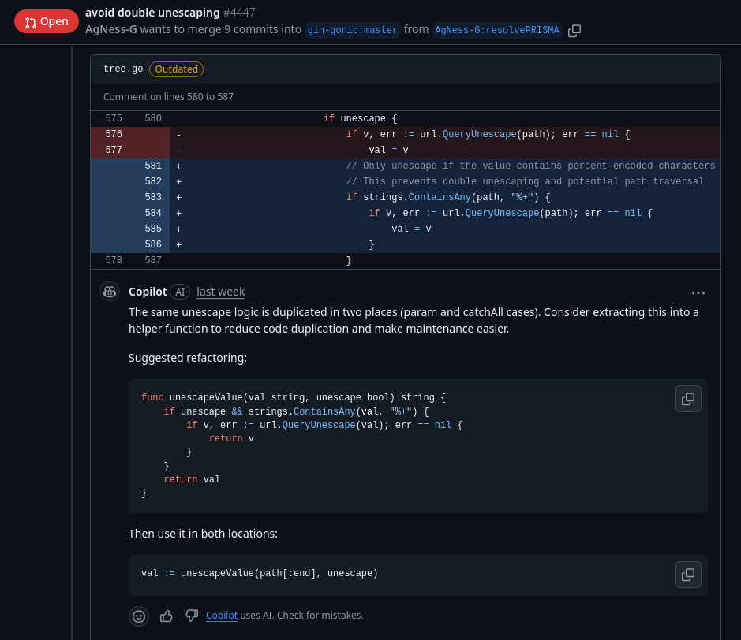
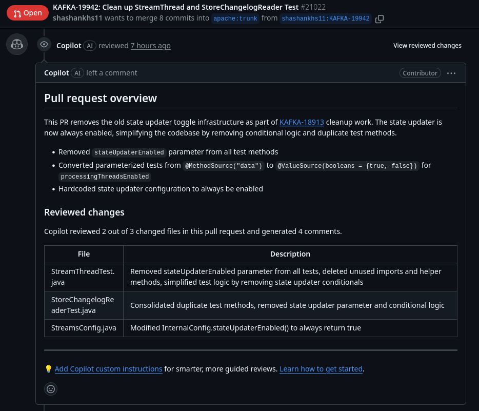
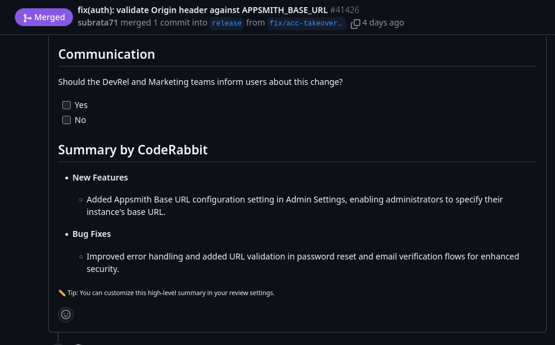

# CI/CD with AI

AI can enhance automated workflows while maintaining reliability through proper guardrails and human oversight.

## Core Principles

AI automation differs from traditional automation—it's probabilistic rather than deterministic, which means it requires different expectations and safeguards.

| Use AI Automation For | Avoid AI Automation For |
|----------------------|-------------------------|
| Variable inputs with consistent process (code review, docs) | Deterministic operations (running tests, deployments) |
| Pattern recognition (security vulnerabilities, code smells) | High-stakes decisions (production approvals) |
| Natural language interfaces (commit messages, release notes) | Security-critical operations requiring guaranteed correctness |
| Augmenting human work (suggestions, assistance) | Replacing critical human judgment |

!!! tip "Augment, Don't Replace"
    AI automation works best when augmenting existing processes, not replacing critical checks. Use AI to improve efficiency while maintaining human oversight for important decisions.

## Common Patterns

### Generate and Review

AI generates content, human reviews it, then the system applies it. Examples include PR descriptions, suggested fixes, and release notes—AI drafts, humans approve.

### Triage and Route

AI classifies items, the system routes them appropriately, then humans handle them. Useful for labeling issues, categorizing support tickets, and identifying PR types for appropriate workflows.

### Augment and Assist

Humans work while AI assists in real-time. Examples include suggesting tests as code is written, checking documentation consistency, and highlighting concerns during code review.

## CI/CD Integration

AI can integrate into pipelines at different stages, each with different risk profiles and appropriate use cases.

### Pipeline Stages

| Stage | AI Applications | Characteristics |
|-------|-----------------|-----------------|
| **Pre-commit** | Code suggestions, local review, commit messages | Interactive, low risk, immediate feedback |
| **Pull Request** | Automated review comments, security analysis, improvements | Advisory, visible to team, can inform merge decisions |
| **Post-merge** | Release notes, changelogs, documentation updates | Lower stakes, regenerable, enhances artifacts |

### Common Use Cases

**PR review automation** analyzes changed files and posts review comments. Tools like GitHub Copilot, CodeRabbit, and others provide this capability with varying approaches to analysis and presentation. Don't block merges on every finding—categorize by severity, allow dismissals, and track accuracy over time.

!!! example "Example: AI Review Comment"
    

    This example shows GitHub Copilot identifying duplicated code logic and suggesting a refactoring approach. The AI provides specific guidance on extracting the duplicated unescape logic into a helper function, complete with code examples. Note the disclaimer "Copilot uses AI. Check for mistakes" at the bottom—a reminder that human review is essential.

**Commit/PR descriptions** generate structured summaries from diffs and commits. Use as templates for humans to refine, not as final content. Match project conventions and include relevant issue references.

!!! example "Example: Generated PR Description"
    

    This example shows Copilot generating a comprehensive PR overview for an Apache Kafka contribution. The AI creates a structured description with:

    - **Pull request overview**: High-level summary of what changed and why
    - **Reviewed changes**: Table showing which files were analyzed and specific findings
    - **Detailed bullet points**: Breaking down individual changes (removed parameters, converted tests, etc.)

    The AI reviewed 2 out of 3 changed files and generated 4 comments, demonstrating how it provides both overview documentation and detailed code review in a single workflow.

**Release notes compilation** groups merged PRs by category with user-facing language. Always review before publishing and maintain consistent formatting.

!!! example "Example: Generated Release Notes"
    

    This example shows CodeRabbit generating a high-level "Summary by CodeRabbit" for a merged PR. The AI automatically categorizes changes into:

    - **New Features**: User-facing improvements (e.g., "Added Appsmith Base URL configuration in Admin Settings")
    - **Bug Fixes**: Issues resolved (e.g., "Improved error handling and URL validation for enhanced security")

    The language is clear and user-focused rather than technical. Note the tip at the bottom indicating users can customize this summary format in their review settings—demonstrating configurability of AI automation tools.

### Pipeline Considerations

**Fail-safe design:** AI steps should not break pipelines. Make AI analysis optional (continue_on_error), set reasonable timeouts, and ensure core pipeline steps remain reliable.

**Cost control:** Limit AI operations to key branches, skip draft PRs, cap file sizes, and cache results when appropriate using content hashes.

**Observability:** Log AI decisions and rationale, record inputs and outputs, and track metrics like false positive rate, detection accuracy, time added to pipeline, and developer override rate.

### Security and Quality

**Data exposure:** Consider what goes to AI services (source code, environment variables, discussions). Filter sensitive files, redact secrets, and use self-hosted models for highly sensitive code.

**Supply chain risk:** AI suggestions should be reviewed like any other code. Don't auto-apply changes—maintain the pattern of AI suggests, humans approve.

**Feedback loops:** When developers dismiss AI comments, record dismissals and use that data to improve prompts and filters. Monitor false positive rates to maintain developer trust.

## Key Takeaways

- AI automation should augment processes, not gate critical operations.
- Design for graceful failure—pipelines must remain reliable when AI fails.
- Keep humans in the loop for important decisions through generate-and-review patterns.
- Monitor accuracy, cost, and developer trust metrics continuously.
- Consider security implications of sending code to AI services.

## Related Reading

- [Testing with AI](testing.md) - AI-assisted testing patterns
- [Security](security/index.md) - Data handling and security considerations
